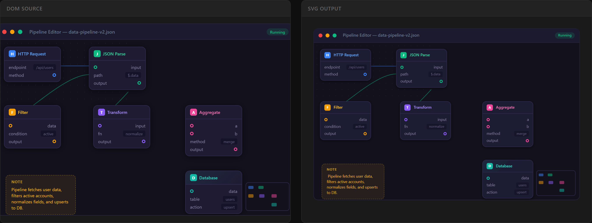
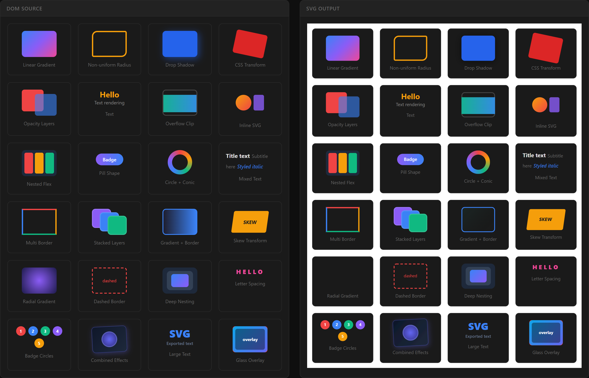

# dom2svg

Convert DOM elements to clean, self-contained SVG files.

Built for exporting node-based editors (SvelteFlow, React Flow, etc.) to vector graphics. Handles mixed HTML/SVG structures that existing libraries fail on.

## Demo

A node-based pipeline editor — DOM on the left, exported SVG on the right:



Real-world UI components (stat cards, avatars, alerts, buttons, progress bars, charts, palettes, tables):


37 CSS features rendered as DOM elements and their SVG counterparts:



## Install

```bash
npm install github:milanofthe/dom2svg
```

## Quick Start

```ts
import { domToSvg } from "dom2svg";

const element = document.querySelector("#my-editor");
const result = await domToSvg(element);

// Download as .svg file
result.download("export.svg");
```

## Examples

### Export with white background and padding

```ts
const result = await domToSvg(element, {
  background: "#ffffff",
  padding: 20,
});
```

### Download or get the SVG as a string/blob

```ts
const result = await domToSvg(element);

// Trigger browser download
result.download("diagram.svg");

// Get SVG markup (e.g. for saving to a server)
const svgString = result.toString();

// Get a Blob (e.g. for FormData upload)
const blob = result.toBlob();
```

### Exclude elements from export

```ts
// By CSS selector
const result = await domToSvg(element, {
  exclude: ".toolbar, .minimap, [data-no-export]",
});

// By predicate
const result = await domToSvg(element, {
  exclude: (el) => el.tagName === "BUTTON",
});
```

### Text-to-path (font-independent output)

Convert text to `<path>` elements so the SVG renders identically without any fonts installed. Requires [opentype.js](https://github.com/opentypejs/opentype.js) (bundled dependency).

```ts
const result = await domToSvg(element, {
  textToPath: true,
  fonts: {
    // Simple: family → URL
    "Inter": "/fonts/Inter-Regular.woff2",

    // Detailed: family → config with weight/style
    "Inter": {
      url: "/fonts/Inter-Bold.woff2",
      weight: "700",
      style: "normal",
    },
  },
});
```

### Custom element handler

Override rendering for specific elements:

```ts
const result = await domToSvg(element, {
  handler: (el, ctx) => {
    // Replace a placeholder with a custom SVG shape
    if (el.classList.contains("chart-placeholder")) {
      const circle = ctx.svgDocument.createElementNS(
        "http://www.w3.org/2000/svg",
        "circle",
      );
      circle.setAttribute("cx", "50");
      circle.setAttribute("cy", "50");
      circle.setAttribute("r", "40");
      circle.setAttribute("fill", "#3b82f6");
      return circle;
    }
    return null; // fall through to default rendering
  },
});
```

### Export a SvelteFlow editor

```svelte
<script>
  import { domToSvg } from "dom2svg";

  async function exportDiagram() {
    const editor = document.querySelector(".svelte-flow");
    const result = await domToSvg(editor, {
      background: "#ffffff",
      padding: 24,
      exclude: ".svelte-flow__controls, .svelte-flow__minimap",
    });
    result.download("diagram.svg");
  }
</script>

<button onclick={exportDiagram}>Export SVG</button>
```

### Export a React Flow editor

```tsx
import { domToSvg } from "dom2svg";

function ExportButton() {
  const handleExport = async () => {
    const editor = document.querySelector(".react-flow");
    const result = await domToSvg(editor, {
      background: "#ffffff",
      padding: 24,
      exclude: ".react-flow__controls, .react-flow__minimap",
    });
    result.download("flowchart.svg");
  };

  return <button onClick={handleExport}>Export SVG</button>;
}
```

## API

### `domToSvg(element, options?)`

Converts a DOM element tree into a self-contained SVG.

**Parameters:**

| Parameter | Type | Description |
|-----------|------|-------------|
| `element` | `Element` | The root DOM element to convert |
| `options` | `DomToSvgOptions` | Optional configuration (see below) |

**Returns:** `Promise<DomToSvgResult>`

| Property | Type | Description |
|----------|------|-------------|
| `svg` | `SVGSVGElement` | The generated SVG element |
| `toString()` | `string` | Serialized SVG with XML declaration |
| `toBlob()` | `Blob` | SVG as `image/svg+xml` blob |
| `download(filename?)` | `void` | Triggers browser download |

### Options

```ts
interface DomToSvgOptions {
  /** Background color for the SVG (default: transparent) */
  background?: string;

  /** Padding around the captured area in px (default: 0) */
  padding?: number;

  /** CSS selector or predicate to exclude elements */
  exclude?: string | ((element: Element) => boolean);

  /** Convert text to <path> elements using opentype.js (default: false) */
  textToPath?: boolean;

  /** Font mapping for text-to-path (family name → URL or config) */
  fonts?: Record<string, string | { url: string; weight?: string; style?: string }>;

  /** Custom element handler — return SVGElement to override, null for default */
  handler?: (element: Element, context: RenderContext) => SVGElement | null;
}
```

## Supported CSS Features

| Feature | Support |
|---------|---------|
| Background colors | Full |
| Linear gradients | Full (correct diagonal angles on non-square elements) |
| Radial gradients | Full (circle and ellipse, rasterized via Canvas) |
| Conic gradients | Full (rasterized via Canvas) |
| Multiple backgrounds | Full (layered in correct CSS order) |
| Background size/position | Full (`contain`, `cover`, explicit sizes) |
| Background images (`url()`) | Full (inlined as data URLs) |
| Borders (uniform and per-side) | Full (solid, dashed, dotted) |
| Border radius (uniform and non-uniform) | Full (including pill shapes) |
| Box shadow | Full (outer and inset, multiple, spread, blur) |
| Outline | Full (solid, dashed, dotted with offset) |
| CSS transforms | Full (translate, rotate, scale, skew, matrix) |
| Transform origin | Full |
| Opacity | Full |
| Overflow clipping | Full (`hidden`, `clip`, `scroll`, `auto`) |
| `clip-path` | Full (`inset`, `circle`, `ellipse`, `polygon`, `path`) |
| Z-index / stacking contexts | Full (CSS 2.2 paint order) |
| Inline SVGs | Full (deep clone with ID namespacing) |
| `` elements | Full (inlined as data URLs) |
| `<canvas>` elements | Full (via `toDataURL()`) |
| Form elements | Full (`<input>`, `<select>`, `<textarea>` values and placeholders) |
| Pseudo-elements (`::before`, `::after`) | Partial (text content) |
| `drop-shadow()` filter | Full |
| Text rendering | Full (`<text>` elements, or `<path>` with `textToPath`) |
| Text shadow | Full (single and multiple, via SVG filters) |
| Text decoration | Full (underline, line-through) |
| Text transform | Full (uppercase, lowercase, capitalize) |
| Text overflow (ellipsis) | Full (appends ellipsis character) |
| Letter spacing | Full |
| List markers | Full (disc, circle, square, decimal) |
| `visibility: hidden` | Correctly skipped (children still rendered) |
| `display: none` | Correctly skipped |

## Architecture

```
src/
├── index.ts              # domToSvg() entry point
├── types.ts              # All TypeScript interfaces
├── core/
│   ├── traversal.ts      # DOM tree walking
│   └── styles.ts         # CSS property parsing
├── renderers/
│   ├── html-element.ts   # HTML → SVG (backgrounds, borders, overflow, pseudo)
│   ├── svg-element.ts    # SVG cloning with ID namespacing
│   └── text-node.ts      # Text → <text> or <path>
├── assets/
│   ├── images.ts         # Image/canvas → data URL inlining
│   ├── fonts.ts          # Font loading + text-to-path (opentype.js)
│   ├── gradients.ts      # CSS gradient → SVG gradient / rasterized image
│   ├── filters.ts        # drop-shadow → SVG filter
│   ├── box-shadow.ts     # box-shadow → SVG filter / mask
│   ├── clip-path.ts      # clip-path → SVG clipPath
│   └── text-shadow.ts    # text-shadow → SVG filter
├── transforms/
│   ├── parse.ts          # CSS transform string parsing
│   ├── matrix.ts         # 2D affine matrix operations
│   └── svg.ts            # CSS transform → SVG transform attribute
└── utils/
    ├── dom.ts            # SVG namespace helpers, DOM type guards
    ├── id-generator.ts   # Unique ID generation
    └── geometry.ts       # Bounding box and rounded-rect path utilities
```

Single runtime dependency: [opentype.js](https://github.com/opentypejs/opentype.js) (only used when `textToPath` is enabled).

## Development

```bash
npm install
npm run build        # ESM + CJS bundles via tsup
npm run type-check   # TypeScript strict mode
npm run test         # 162 unit tests via Vitest
npm run test:watch   # Watch mode
npm run demo         # Visual demo at localhost:5173
```

## License

MIT
